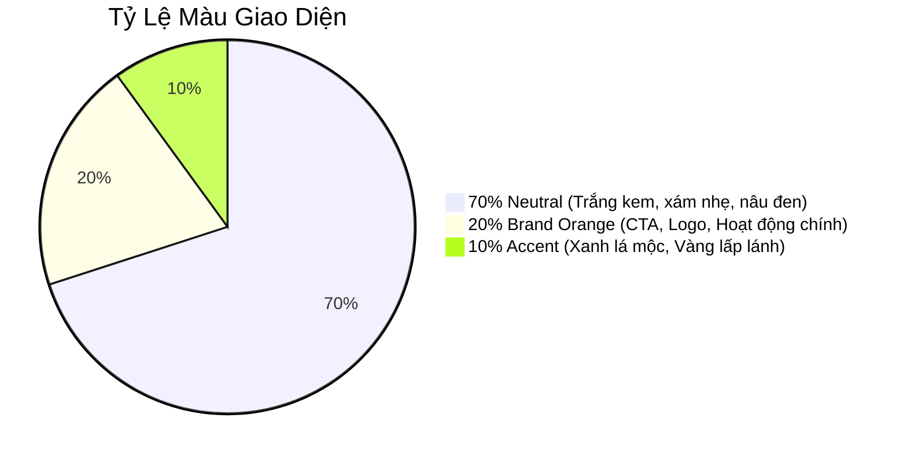

# Warm Productivity - Quy Tắc Thiết Kế UI Toàn Dự Án

Tài liệu này định nghĩa hệ thống nhận diện màu sắc thương hiệu và các quy tắc phối màu bắt buộc đối với toàn bộ giao diện (UI) trong dự án. Mọi thay đổi UI hoặc phát triển component mới bắt buộc phải tuân thủ nghiêm ngặt các quy tắc dưới đây.

---

## 1. Bảng Màu Hệ Thống (Color Palette)

### 🔴 Nhóm Màu Chính (Primary & Brand)
Sử dụng cho các yếu tố nhận diện thương hiệu, nút bấm chủ chốt (CTA), liên kết nổi bật và các trạng thái active quan trọng.
* **Brand Orange (`#E95C47`):** Màu sắc đại diện chính, tràn đầy năng lượng nhưng ấm áp.
* **CTA Hover (`#D94B35`):** Màu cam trầm khi hover qua các nút bấm kêu gọi hành động.
* **Soft Peach (`#F6DDD5`):** Màu đào dịu làm nền nhẹ cho các nhãn, badge, trạng thái bổ sung.
* **Light Coral (`#F2C8BC`):** Màu san hô nhẹ nhàng dùng làm viền hoặc điểm nhấn trung gian.

### 🟤 Nhóm Màu Trung Tính (Neutrals)
Chiếm phần lớn không gian màn hình, được tinh lọc độ bão hòa (saturation) cực thấp để tạo sự thư giãn và chống mỏi mắt tốt nhất.
* **Main Background (`#F8F6F3`):** Màu trắng kem ấm áp làm nền cho toàn bộ ứng dụng (tránh màu trắng tinh tinh khiết gây chói).
* **Card Background (`#FFFDFB`):** Màu trắng ngà sáng nhẹ dùng làm nền cho các khối thẻ (card), bảng biểu, form nhập liệu.
* **Border/Subtle (`#E7E1DB`):** Màu xám kem rất nhẹ dùng cho các đường viền phân cách, tạo cấu trúc UI tự nhiên mà không bị thô cứng.
* **Text Primary (`#1F1A17`):** Màu nâu đen trầm tự nhiên làm màu chữ chính (tránh màu đen kịt kỹ thuật số `#000000` gây căng thẳng cho mắt).
* **Text Secondary (`#5F5A56`):** Màu xám nâu trầm làm màu chữ phụ, chú thích, gợi ý.

### 🟢 Nhóm Màu Nhấn Trang Trí (Accents)
Chỉ dùng cho mục đích trang trí nghệ thuật hoặc làm họa tiết trang nhã, bổ trợ tính sinh động.
* **Soft Green Wave (`#DDE6D3`):** Màu xanh lá mộc mạc cho các thẻ hoàn thành, họa tiết lượn sóng tự nhiên.
* **Yellow Spark (`#F3B736`):** Màu vàng lấp lánh cho các điểm nhấn sáng tạo, ngôi sao yêu thích, hoặc hiệu ứng lấp lánh (sparkles).

---

## 2. Quy Tắc Phối Màu Bắt Buộc (Tỷ Lệ Vàng 70 - 20 - 10)

Để giao diện đạt được cảm quan cao cấp của các ứng dụng năng suất hàng đầu, toàn bộ bố cục trang và component phải phân bổ màu sắc đúng tỷ lệ:

### 🥛 70% Neutral (Không Gian Thở)
* **Nền tảng:** Sử dụng `#F8F6F3` làm nền chính của toàn màn hình. Các khu vực tính năng được tách biệt bằng các khối thẻ `#FFFDFB` bo góc tinh tế với bóng mờ siêu nhẹ (`rgba(31, 26, 23, 0.04)`).
* **Đường nét:** Các đường kẻ, viền phải mảnh (`1px`) và dùng màu `#E7E1DB`.
* **Chữ:** Luôn dùng màu `#1F1A17` cho tiêu đề và chữ chính để duy trì độ tương phản tối đa nhưng vẫn dịu mắt.

### 🍊 20% Brand Orange (Hành Động & Tập Trung)
* **CTA chính:** Các nút bấm quan trọng nhất phải được phủ màu cam `#E95C47` với chữ màu trắng ngà `#FFFDFB`. Khi di chuột qua, nút bấm chuyển sang `#D94B35`.
* **Điểm hướng:** Sử dụng màu cam cho các icon active, liên kết có độ ưu tiên cao, và các tag/badge biểu thị trạng thái nổi bật.
* **Quy tắc tuyệt đối:** Không lạm dụng màu cam làm nền cho các vùng lớn hơn `150px` (trừ nút bấm hoặc logo). Màu cam phải đóng vai trò là một "ngọn hải đăng" thu hút sự chú ý của người dùng một cách có mục đích.

### ✨ 10% Accent (Cảm Hứng Nghệ Thuật)
* **Trang trí phụ:** Chỉ sử dụng màu xanh lá `#DDE6D3` hoặc màu vàng `#F3B736` cho các nhãn biểu thị sự thành công, họa tiết nhỏ, hoặc hình minh họa lấp lánh trang trí.
* **Quy tắc tuyệt đối:** Không bao giờ dùng màu Accent cho các nút bấm chính hoặc chữ dài, vì chúng có độ tương phản thấp đối với nền kem.

---

## 3. Bản Đồ Ánh Xạ CSS Classes (Tailwind & Scss)

Khi viết code, hãy luôn dùng các class tiện ích sau để bảo toàn hệ thống màu:

| Vai Trò | Lớp CSS (Tailwind) | Biến CSS (Scss) | Giá trị HEX |
| :--- | :--- | :--- | :--- |
| **Nền trang chính** | `bg-background` | `var(--ui-bg-page)` | `#F8F6F3` |
| **Nền thẻ/hộp thoại** | `bg-card` | `var(--ui-bg-surface)` | `#FFFDFB` |
| **Màu chữ chính** | `text-foreground` | `var(--ui-text)` | `#1F1A17` |
| **Màu chữ chú thích** | `text-muted-foreground` | `var(--ui-text-muted)` | `#5F5A56` |
| **Nút bấm chính (CTA)** | `bg-primary` | `var(--primary-500)` | `#E95C47` |
| **Nút bấm Hover** | `hover:bg-primary-hover` | `var(--primary-600)` | `#D94B35` |
| **Đường viền** | `border-border` | `var(--ui-border)` | `#E7E1DB` |
| **Màu nhấn xanh** | `bg-accent` | `var(--accent-green)` | `#DDE6D3` |
| **Màu nhấn vàng** | `text-yellow` | `var(--accent-yellow)` | `#F3B736` |
